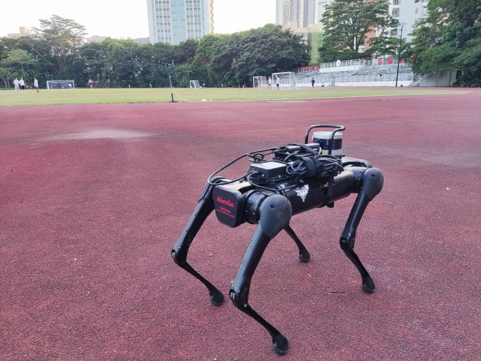

# Quadruped_State_Estimation

## Introduction

This repository includes the state estimator and the terrain estimator for the quadruped. The state estimator using **Linear Kalman** to estimate the position and velocity of the quadruped centroid. The terrain estimator estimates the **normal vector** of the  quadruped located ground. The algorithm is validated on real robot **Aliengo** and can be deployed to other quadruped robots.



## Installation

The project depends on **Pinocchio**, **Eigen**, **ROS** and runs on **ubuntu2004**.

### ROS

You can follow the [tutorial](http://wiki.ros.org/noetic/Installation/Ubuntu) to install ROS Noetic.

### Eigen

The version we use is [Eigen 3.3.9](https://eigen.tuxfamily.org/index.php?title=Main_Page). You can download the source code from the official website and install it.

### Pinocchio

Pinocchio can be installed from [tutorial](https://github.com/stack-of-tasks/pinocchio).

### Our project

```
mkdir -p catkin_ws/src
catkin_init_workspace
git clone https://github.com/skywoodsz/Quadruped-State-Estimation.git
cd ..
catkin_make
```


## Run

1. Establish communication with the quadruped.

```
cd catkin_ws
sudo su
source devel/setup.bash
rosrun rosrun aliengo_control aliengo_low_level_node
```

2. Run the state estimator and the terrain estimator.

```
mon launch kf_estimator LegSlam_bringup.launch 
```

3. Visualize with RVIZ

```
mon launch kf_estimator rviz.launch
```


## Framework

- aliengo_control:  communicate with aliengo.
- cheetah_msgs: custom msg.
- unitree_description: Robot urdf model, used for forward kinematics.
- kf_estimator/state_estimate: kalman eatimator.
- kf_estimator/terrain_estimator: terrain_estimator.

## ROS Topic

- /dog/imu_data: imu raw data.
- /dog/motor_data: quadruped joint data, including joint angles and velocities.
- /dog/leg_contact: quadruped contact Leg Information.
- /odom: state estimation result.
- /dog/terrain_norm: ground estimated normal vector.


